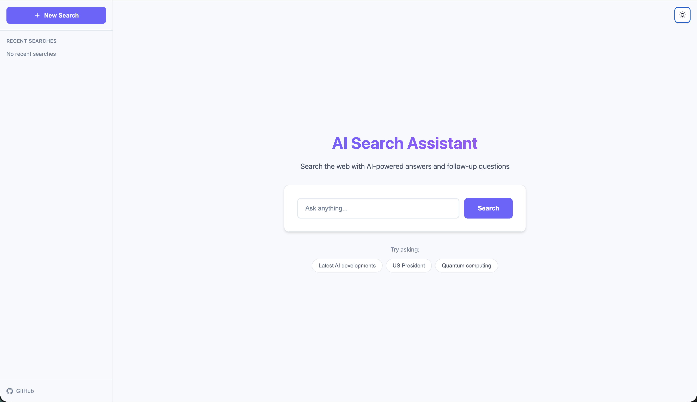
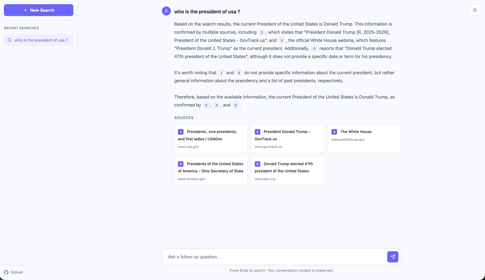

# AI Search Assistant

A [Perplexity](https://perplexity.ai/)-style AI search assistant with conversational search, real-time streaming responses, and context memory. Built with [Groq](https://groq.com/) for LLM inference, [Exa.ai](https://exa.ai/) for neural search, and [Render](https://render.com/) for deployment with [Render Postgres](https://render.com/docs/postgresql-refresh).

[](https://render.com/deploy?repo=https://github.com/ojusave/search_engine)

## Screenshots


*Perplexity-style conversational search interface with real-time streaming responses*


*AI-generated answers with source citations and conversation history*

## Features

- **Conversational Search** - Ask follow-up questions that understand context
- **Real-time Streaming** - Answers appear word-by-word using [Server-Sent Events (SSE)](https://developer.mozilla.org/en-US/docs/Web/API/Server-sent_events)
- **Smart Query Rewriting** - Automatically expands ambiguous queries using conversation history
- **Source Citations** - Inline citations with clickable source cards
- **Conversation History** - Database persistence or in-memory storage
- **One-Click Deployment** - Deploy to [Render](https://render.com/) with automatic database provisioning

## Prerequisites

**API Keys Required:**
- **Groq API Key**: Sign up at [console.groq.com](https://console.groq.com/) and create an API key
- **Exa.ai API Key**: Sign up at [dashboard.exa.ai](https://dashboard.exa.ai/) and get your API key

> **Note**: For production deployment on Render, the free tier database (1GB, 30-day expiry) is suitable for testing. Upgrade to a paid plan ($7/month+) for production use.

## Quick Start

### Local Development

```bash
npm install
cp .env.example .env
# Edit .env and add your API keys (see Prerequisites above)
npm start
```

Open `http://localhost:3000`

> **Note**: `DATABASE_URL` is optional - the app uses in-memory storage if not set.

### Deploy to Render

> ⚠️ **Get API keys first** (see [Prerequisites](#prerequisites))

Click the "Deploy to Render" button above, then see [Deployment](#deployment) for complete setup instructions.

## How It Works

The system loads conversation history, rewrites ambiguous queries using [Groq](https://groq.com/), searches the web with [Exa.ai](https://exa.ai/), streams AI-generated answers with source citations, and saves Q&A pairs to conversation history.

## Project Structure

Key files: [`server.js`](server.js) (Express API), [`components/llm.js`](components/llm.js) (Groq streaming), [`components/search.js`](components/search.js) (Exa.ai), [`components/database.js`](components/database.js) (PostgreSQL), [`render.yaml`](render.yaml) (deployment), [`.env.example`](.env.example) (config template).

## Configuration

### Environment Variables

See [`.env.example`](.env.example) for the complete template:

| Variable | Required | Description |
|----------|----------|-------------|
| `GROQ_API_KEY` | Yes | Groq API credentials |
| `EXA_API_KEY` | Yes | Exa.ai API credentials |
| `DATABASE_URL` | No | PostgreSQL connection string (optional) |
| `PORT` | No | Server port (defaults to 3000) |

### Customization

- **AI Model**: Edit [`config.js`](config.js) - see [Groq Models](https://console.groq.com/docs/models)
- **Search Results**: Edit [`public/app.js`](public/app.js) - see [Exa.ai API](https://docs.exa.ai/reference/search)
- **AI Behavior**: Edit system prompt in [`components/llm.js`](components/llm.js)

## Database Setup

**Automatic:** Uses [`render.yaml`](render.yaml) when deploying (see [Deployment](#deployment)). The `DATABASE_URL` is auto-injected and schema is created on first startup.

**Manual:** See [Manual Deployment](#manual-deployment) section below.

**No Database:** If `DATABASE_URL` is not set, the app uses in-memory storage (lost on restart).


## Deployment

### Automatic Deployment (Recommended)

The project includes a [`render.yaml`](render.yaml) blueprint that automatically provisions the web service and [Render Postgres](https://render.com/docs/postgresql-refresh) database.

**Steps:**
1. Click the "Deploy to Render" button above, or deploy from [Render Dashboard](https://dashboard.render.com/) by selecting the repository with `render.yaml`
2. Add environment variables in the dashboard: `GROQ_API_KEY`, `EXA_API_KEY` (get from [Prerequisites](#prerequisites))

### Manual Deployment

For manual setup without `render.yaml`:

1. **Push code to GitHub**
2. **Create Web Service:**
   - Go to [Render Dashboard](https://dashboard.render.com/) → "New" → "Web Service"
   - Connect your GitHub repository
   - Configure: Name, Runtime (Node), Build Command (`npm install`), Start Command (`npm start`)
3. **Create Database (Optional):**
   - Go to Dashboard → "New" → "PostgreSQL"
   - Configure: Name, Database, User, Plan
   - Copy the **Internal Database URL**
4. **Add Environment Variables:**
   - Add API keys from [Prerequisites](#prerequisites): `GROQ_API_KEY`, `EXA_API_KEY`
   - Add `DATABASE_URL` from step 3 (optional)
5. **Deploy!**

## API Reference

**Endpoints:** `POST/GET /api/conversations`, `GET /api/conversations/:id/search/stream` (SSE), `GET /api/search/stream`, `POST /api/search`

**SSE Events:** `status`, `rewrite`, `sources`, `chunk`, `done`, `error` - see [Server-Sent Events](https://developer.mozilla.org/en-US/docs/Web/API/Server-sent_events)

## License

[MIT](https://opensource.org/licenses/MIT)
