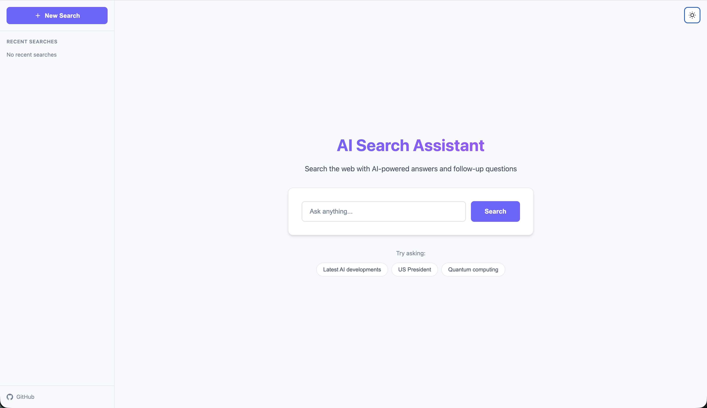
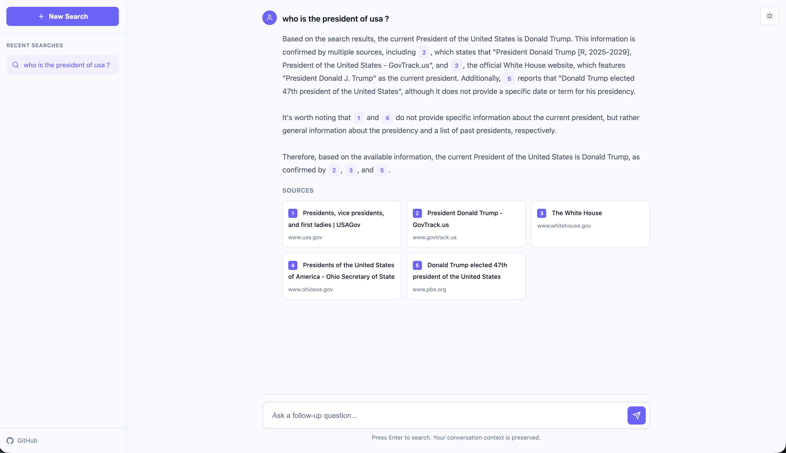

# AI Search Assistant

A [Perplexity](https://perplexity.ai/)-style AI search assistant with conversational search, real-time streaming responses, and context memory. Built with [Groq](https://groq.com/) for LLM inference, [Exa.ai](https://exa.ai/) for neural search, and [Render](https://render.com/) for deployment with [Render Postgres](https://render.com/docs/postgresql-refresh).

[](https://render.com/deploy?repo=https://github.com/ojusave/search_engine)&nbsp;&nbsp;[](https://github.com/ojusave/search_engine)

## Screenshots


*Perplexity-style conversational search interface with real-time streaming responses*


*AI-generated answers with source citations and conversation history*

## Features

- **Conversational Search** — Ask follow-up questions that understand context
- **Real-time Streaming** — Answers appear word-by-word via [Server-Sent Events](https://developer.mozilla.org/en-US/docs/Web/API/Server-sent_events)
- **Smart Query Rewriting** — Automatically expands ambiguous queries using conversation history
- **Source Citations** — Inline citations with clickable source cards
- **Conversation History** — PostgreSQL persistence or in-memory fallback
- **One-Click Deploy** — Deploy to [Render](https://render.com/) with automatic database provisioning

## Prerequisites

**API Keys Required:**
- **Groq API Key** — Sign up at [console.groq.com](https://console.groq.com/) and create an API key
- **Exa.ai API Key** — Sign up at [dashboard.exa.ai](https://dashboard.exa.ai/) and get your API key

> The free-tier Render Postgres database (1 GB, 30-day expiry) works for testing. Upgrade to a paid plan for production.

## Quick Start

### Local Development

```bash
npm install
cp .env.example .env
# Add your API keys to .env
npm start
```

Open `http://localhost:3000`. `DATABASE_URL` is optional — the app uses in-memory storage if unset.

### Deploy to Render

> Get your API keys first (see [Prerequisites](#prerequisites)).

Click the **Deploy to Render** button above, then add your `GROQ_API_KEY` and `EXA_API_KEY` in the Render dashboard.

## How It Works

1. Loads conversation history from Postgres (or in-memory)
2. Rewrites ambiguous follow-up queries using [Groq](https://groq.com/)
3. Searches the web with [Exa.ai](https://exa.ai/)
4. Streams AI-generated answers with source citations
5. Saves the Q&A pair back to conversation history

## Project Structure

```
├── server.js                  # Express API server
├── config.js                  # Environment & API config
├── render.yaml                # Render Blueprint (IaC)
├── components/
│   ├── llm.js                 # Groq streaming & prompt builder
│   ├── search.js              # Exa.ai web search
│   ├── queryRewriter.js       # Context-aware query rewriting
│   ├── responseFormatter.js   # Response formatting & citations
│   └── database.js            # PostgreSQL connection & queries
├── public/
│   ├── index.html             # Frontend shell
│   ├── style.css              # DDS-themed styles
│   └── app.js                 # Frontend logic (SSE, routing, UI)
└── scripts/
    └── init-db.js             # Manual DB schema init
```

## Environment Variables

See [`.env.example`](.env.example) for the template.

| Variable | Required | Description |
|----------|----------|-------------|
| `GROQ_API_KEY` | Yes | Groq API credentials |
| `EXA_API_KEY` | Yes | Exa.ai API credentials |
| `DATABASE_URL` | No | PostgreSQL connection string |
| `PORT` | No | Server port (default: 3000) |

## Deployment

### Automatic (Recommended)

The [`render.yaml`](render.yaml) blueprint provisions the web service and Postgres database automatically.

1. Click **Deploy to Render** above (or import the repo in [Render Dashboard](https://dashboard.render.com/))
2. Add environment variables: `GROQ_API_KEY`, `EXA_API_KEY`

### Manual

1. Push code to GitHub
2. Create a **Web Service** in the [Render Dashboard](https://dashboard.render.com/) — connect your repo, set build (`npm install`) and start (`npm start`) commands
3. Optionally create a **PostgreSQL** database and copy the Internal Database URL
4. Add environment variables: `GROQ_API_KEY`, `EXA_API_KEY`, and optionally `DATABASE_URL`

## API Reference

| Method | Endpoint | Description |
|--------|----------|-------------|
| `POST` | `/api/conversations` | Create a conversation |
| `GET` | `/api/conversations` | List recent conversations |
| `GET` | `/api/conversations/:id` | Get conversation with messages |
| `DELETE` | `/api/conversations/:id` | Delete a conversation |
| `DELETE` | `/api/conversations` | Delete all conversations |
| `GET` | `/api/conversations/:id/search/stream` | Streaming search (SSE) |
| `GET` | `/api/search/stream` | Simple streaming search |
| `POST` | `/api/search` | Non-streaming search |

**SSE Events:** `status`, `rewrite`, `sources`, `chunk`, `done`, `error`

## License

[MIT](https://opensource.org/licenses/MIT)
