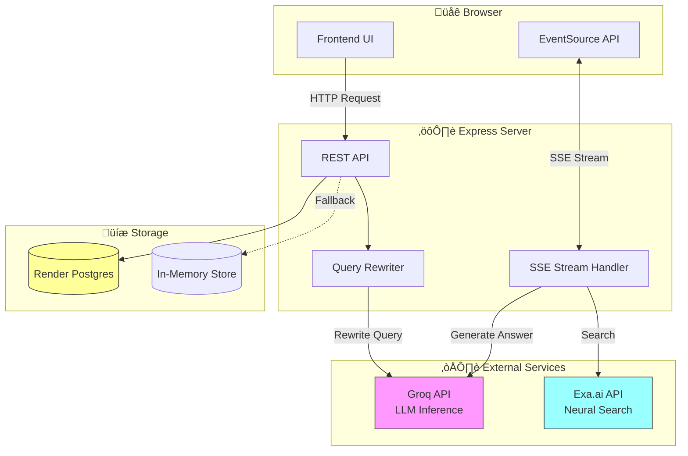
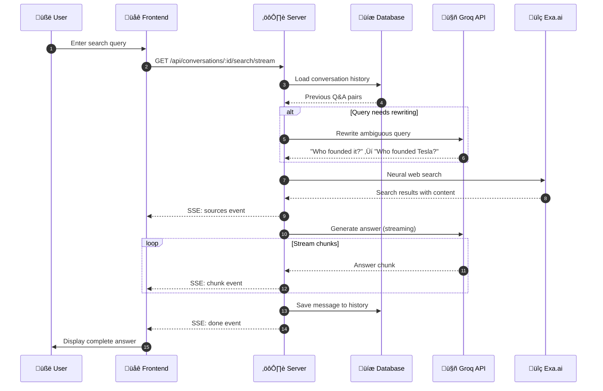

# AI Search Assistant

A [Perplexity](https://perplexity.ai/)-style AI search assistant built with [Groq](https://groq.com/), [Exa.ai](https://exa.ai/), and [Render](https://render.com/) (with [Render Postgres](https://render.com/docs/postgresql-refresh)). Features conversational search with context memory, real-time streaming responses, and a modern dark/light theme UI.

[](https://render.com/deploy?repo=https://github.com/ojusave/search_engine)

## Features

- **Conversational Search** - Ask follow-up questions that understand context
- **Real-time Streaming** - Answers appear word-by-word using [Server-Sent Events (SSE)](https://developer.mozilla.org/en-US/docs/Web/API/Server-sent_events)
- **Smart Query Rewriting** - Automatically expands ambiguous queries using conversation history
- **Source Citations** - Inline citations with clickable source cards
- **Conversation History** - Database persistence or in-memory storage
- **One-Click Deployment** - Deploy to [Render](https://render.com/) with automatic database provisioning

## Quick Start

### 1. Get API Keys

- **Groq**: Sign up at [console.groq.com](https://console.groq.com/) and create an API key
- **Exa.ai**: Sign up at [dashboard.exa.ai](https://dashboard.exa.ai/) and get your API key

### 2. Local Development

```bash
npm install
cp .env.example .env
# Edit .env and add your API keys:
GROQ_API_KEY=your_groq_key
EXA_API_KEY=your_exa_key
# DATABASE_URL is optional - see Database Setup section
npm start
```

Open `http://localhost:3000`

### 3. Deploy to Render

Click the "Deploy to Render" button above, then add your API keys in the [Render Dashboard](https://dashboard.render.com/) under Environment Variables. The database is automatically provisioned via `render.yaml`.

## Architecture



## How It Works

<details>
<summary>View detailed flow diagram</summary>



</details>

**Process:**
1. Load conversation history for context
2. Rewrite ambiguous queries using conversation context
3. Search the web using [Exa.ai](https://exa.ai/)'s neural search
4. Stream AI-generated answers from [Groq](https://groq.com/) with source citations
5. Save Q&A pair to conversation history

## Project Structure

| File | Purpose |
|------|---------|
| [`server.js`](server.js) | Express server with conversation APIs |
| [`config.js`](config.js) | API configuration |
| [`components/search.js`](components/search.js) | [Exa.ai](https://exa.ai/) integration |
| [`components/llm.js`](components/llm.js) | [Groq](https://groq.com/) streaming and query rewriting |
| [`components/database.js`](components/database.js) | Database connection |
| [`components/queryRewriter.js`](components/queryRewriter.js) | Context-aware query expansion |
| [`components/responseFormatter.js`](components/responseFormatter.js) | Format final response |
| [`public/index.html`](public/index.html) | Frontend UI with sidebar layout |
| [`public/app.js`](public/app.js) | EventSource streaming client |
| [`public/style.css`](public/style.css) | Render-style CSS with themes |
| [`render.yaml`](render.yaml) | [Render Blueprint](https://render.com/docs/blueprint-spec) deployment config |
| [`.env.example`](.env.example) | Environment variables template |

## Configuration

### Environment Variables

```bash
GROQ_API_KEY=your_groq_key      # Required
EXA_API_KEY=your_exa_key        # Required
DATABASE_URL=postgresql://...    # Optional
PORT=3000                        # Optional, defaults to 3000
```

### Customization

**Change AI Model** (edit [`config.js`](config.js)):
```javascript
model: 'llama-3.3-70b-versatile'  // Default - best quality
// Other options:
// - 'llama-3.1-8b-instant' (560 t/s, faster for simpler queries)
// - 'openai/gpt-oss-120b' (500 t/s, OpenAI open-weight)
// - 'openai/gpt-oss-20b' (1000 t/s, fastest)
```

See [Groq Models Documentation](https://console.groq.com/docs/models) for full list.

**Adjust Search Results** (edit [`public/app.js`](public/app.js)):
```javascript
numResults: 5  // Change number of sources
```

See the [Exa.ai Search API docs](https://docs.exa.ai/reference/search) for more options.

**Modify AI Behavior** - Edit the system prompt in [`components/llm.js`](components/llm.js) to change answer format, citation style, and tone.

## Database Setup

### Production: [Render Postgres](https://render.com/docs/postgresql-refresh)

Automatically provisioned via [`render.yaml`](render.yaml) when deploying. The `DATABASE_URL` is auto-injected and schema is created on first startup.

**To create manually:**
- **[Render Dashboard](https://dashboard.render.com/)** - Click "New" → "PostgreSQL"
- **Render MCP** - Use the Render Model Context Protocol tools

**Steps (Dashboard):**
1. Go to [Render Dashboard](https://dashboard.render.com/)
2. Click "New" → "PostgreSQL"
3. Configure: Name, Database, User, Plan (Free tier: 1GB, 30-day expiry)
4. Copy the **Internal Database URL** and add as `DATABASE_URL` environment variable

**Benefits:** Zero-configuration setup, automatic backups, SSL by default, managed service. For production, upgrade to a paid plan ($7/month+) to avoid expiration.

**Schema** (auto-created on startup):


<details>
<summary>View SQL Schema</summary>

```sql
-- Stores conversation metadata
CREATE TABLE conversations (
  id UUID PRIMARY KEY,
  title VARCHAR(255),
  created_at TIMESTAMP WITH TIME ZONE DEFAULT NOW(),
  updated_at TIMESTAMP WITH TIME ZONE DEFAULT NOW()
);

-- Stores individual messages (queries and answers)
CREATE TABLE messages (
  id UUID PRIMARY KEY,
  conversation_id UUID REFERENCES conversations(id) ON DELETE CASCADE,
  role VARCHAR(20) NOT NULL,
  query TEXT,
  rewritten_query TEXT,  -- Stores expanded query if rewriting occurred
  answer TEXT,
  sources JSONB,         -- Stores source URLs and snippets
  created_at TIMESTAMP WITH TIME ZONE DEFAULT NOW()
);
```

</details>

### Development: In-Memory Storage

If `DATABASE_URL` is not set, the app automatically uses in-memory storage (conversations stored in a JavaScript `Map`, lost on restart). Perfect for local development and testing.

## Deployment on Render

The project includes a [`render.yaml`](render.yaml) blueprint that automatically provisions:
- Web service with Node.js runtime
- [Render Postgres](https://render.com/docs/postgresql-refresh) database
- `DATABASE_URL` environment variable (auto-injected)

**Steps:**
1. Click the "Deploy to Render" button above, or deploy from [Render Dashboard](https://dashboard.render.com/) by selecting the repository with `render.yaml`
2. Add environment variables in the dashboard:
   - `GROQ_API_KEY` - Get from [console.groq.com](https://console.groq.com/)
   - `EXA_API_KEY` - Get from [dashboard.exa.ai](https://dashboard.exa.ai/)

<details>
<summary>View render.yaml configuration</summary>

```yaml
databases:
  - name: search-assistant-db
    plan: free
    databaseName: search_assistant
    user: search_user

services:
  - type: web
    name: ai-search-assistant
    runtime: node
    plan: free
    buildCommand: npm install
    startCommand: npm start
    healthCheckPath: /health
    envVars:
      - key: NODE_ENV
        value: production
      - key: GROQ_API_KEY
        sync: false
      - key: EXA_API_KEY
        sync: false
      - key: DATABASE_URL
        fromDatabase:
          name: search-assistant-db
          property: connectionString
```

</details>

**Alternative: Manual Dashboard Setup**

1. Push your code to GitHub
2. Go to [Render Dashboard](https://dashboard.render.com/) → "New" → "Web Service"
3. Connect your GitHub repository
4. Configure: Name, Runtime (Node), Build Command (`npm install`), Start Command (`npm start`)
5. Add environment variables: `GROQ_API_KEY`, `EXA_API_KEY`, `DATABASE_URL` (optional)
6. Deploy!

## API Reference

### REST Endpoints

| Method | Endpoint | Description |
|--------|----------|-------------|
| `POST` | `/api/conversations` | Create a new conversation |
| `GET` | `/api/conversations` | List recent conversations |
| `GET` | `/api/conversations/:id` | Get conversation with messages |
| `DELETE` | `/api/conversations/:id` | Delete a conversation |
| `GET` | `/api/conversations/:id/search/stream` | Streaming search with context (SSE) |
| `GET` | `/api/search/stream` | Simple streaming search (no context) |
| `POST` | `/api/search` | Non-streaming search |

### Server-Sent Events (SSE)

The streaming endpoints use [Server-Sent Events](https://developer.mozilla.org/en-US/docs/Web/API/Server-sent_events) to push real-time updates:

| Event | Data | Description |
|-------|------|-------------|
| `status` | `{ message, step }` | Progress updates |
| `rewrite` | `{ original, rewritten }` | Query was rewritten for context |
| `sources` | `{ sources[], sourceCount }` | Search results found |
| `chunk` | `{ text }` | Answer text chunk |
| `done` | `{ messageId, totalDuration }` | Stream complete |
| `error` | `{ message }` | Error occurred |

## Tech Stack

| Technology | Purpose |
|------------|---------|
| **[Groq](https://groq.com/)** | Ultra-fast LLM inference (<1s responses) |
| **[Exa.ai](https://exa.ai/)** | Neural search (semantic understanding) |
| **[Render](https://render.com/)** | Zero-config cloud hosting with auto-scaling |
| **[Render Postgres](https://render.com/docs/postgresql-refresh)** | Managed PostgreSQL with automatic provisioning |

## License

[MIT](https://opensource.org/licenses/MIT)
